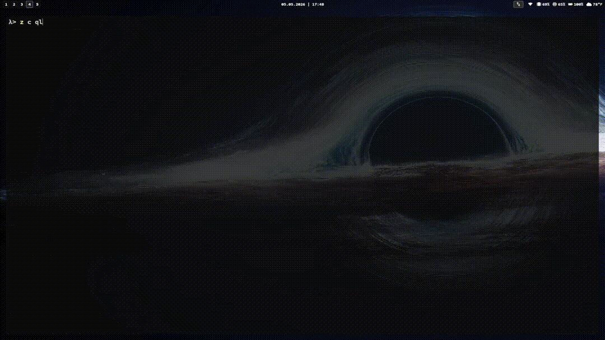

# C-Qlearning

A little Q-learning playground written in C, with a GUI built on raylib/raygui.

You draw a maze, train an agent on it, and then watch the agent solve it. That's the whole idea.



## What's inside

The unified app has four modes:

- **Menu** — the entry screen.
- **Maze Editor** — draw, generate, load and save mazes.
- **Trainer** — train an agent and watch reward / loss / success-rate graphs in real time. Exports a CSV if you want to plot things later.
- **Viewer** — load a trained Q-table and watch the agent walk the maze. You can right-click to teleport it, press `T` to leave a trail of arrows, `Z` to lock the camera on it, and the arrow keys to slow down / speed up.

There are also a few standalone CLI/GUI binaries for the same pieces (`agentCLI`, `agentTrain`, `agentViewer`, `mazeEditor`) if you'd rather use them separately.

## Building

You'll need `gcc`, `make`, and `windres` (the project targets Windows).

```
make
```

Binaries land in `build/`. Run `build/Cqlearning.exe` for the unified GUI.

To clean:

```
make clean
```

## Files you'll see lying around

- `mapas/` — example mazes
- `qtables/` — saved Q-tables
- `metrics/` — CSVs from training runs
- `plot.py` — a small helper to plot those CSVs

## Why

Mostly because writing reinforcement learning from scratch in C is a fun way to actually understand what Q-learning is doing — no PyTorch, no gym, just a table of numbers and a maze.
